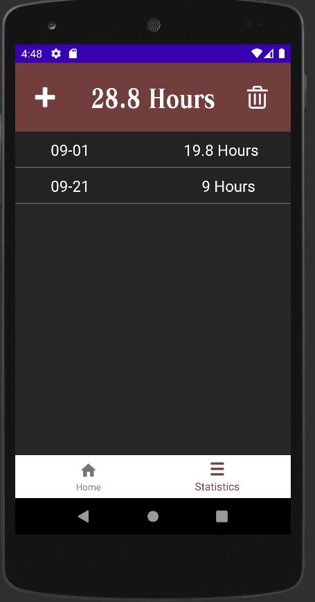
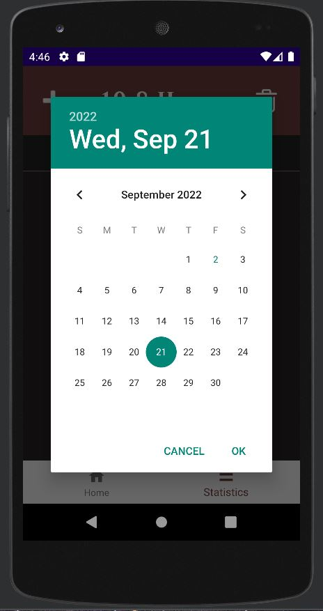

This software could store every day of your working time by clicking the finishing working button. The starting working time is 9:00 am. It has a database that could hold a maximum of one year of data. You could modify the date and working hours if one day you forget to click the finishing working button.

Since it's a simple project for my friend to count his working time, there is no multi-thread optimization in realm database. MVVM structure haven't been totally followed. These coding parts could be improve.

